---
## Author
author:
  name: Петрова Алевтина Александровна
  email: 1132236047@rudn.ru
  affiliation:
    - name: Российский университет дружбы народов
      country: Российская Федерация
      postal-code: 117198
      city: Москва
      address: ул. Миклухо-Маклая, д. 6
## Title
title: Презентация Лабораторной работы №5
subtitle: Имитационное моделирование
license: CC BY
date: today
date-format: "YYYY-MM-DD" # Example: 2025-09-06
---

## Цель работы

— Построить сеть Петри для пяти философов, моделируя захват и освобождение
вилок.
— Обнаружить состояние взаимной блокировки (deadlock), когда каждый философ взял одну вилку и ждёт вторую.
— Провести имитационное моделирование (стохастическое и детерминированное) и выявить наличие deadlock.
— Модифицировать сеть, чтобы предотвратить deadlock.
— Проанализировать результаты и оформить отчёт с графиками и анимацией.

## Код модели

Предварительно создав рабочий каталог для выполнения лабораторной работы, создадим файл src/DiningPhilosophers.jl с описанием базовой модели ([рис. @fig-001]).

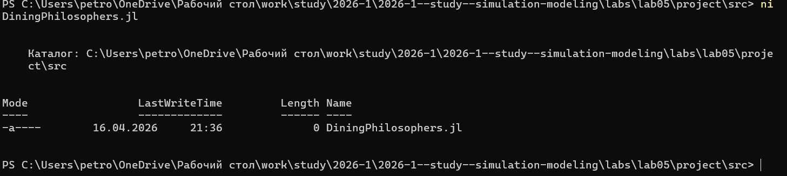{#fig-001 width=70%}

## Код модели

Вставляем скрипт в файл ([рис. @fig-002])

{#fig-002 width=70%}

## Базовые эксперименты

Создадим файл scripts/dining_philosophers.jl. Скрипт выполняет основное моделирование и сравнение двух вариантов сети
Петри:
— классическая модель (без арбитра), в которой возможна взаимная блокировка
(deadlock);
— модифицированная модель с арбитром, которая должна предотвращать
deadlock.  ([рис. @fig-003]).

{#fig-003 width=70%}

## Базовые эксперименты

Запустим скрипт ([рис. @fig-004]).

{#fig-004 width=70%}

## Базовые эксперименты

Посмотрим результирующую таблицу dining_arbiter.csv ([рис. @fig-005]).

{#fig-005 width=70%}

## Базовые эксперименты

Посмотрим результирующую таблицу dining_classic.csv ([рис. @fig-006]).

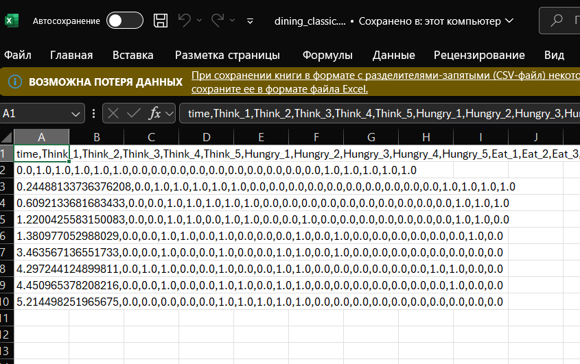{#fig-006 width=70%}

## Базовые эксперименты

Смотрим результирующее изображение arbiter_simulation.png ([рис. @fig-007]).

{#fig-007 width=70%}

## Базовые эксперименты

Смотрим результирующее изображение classic_simulation.png ([рис. @fig-008]).

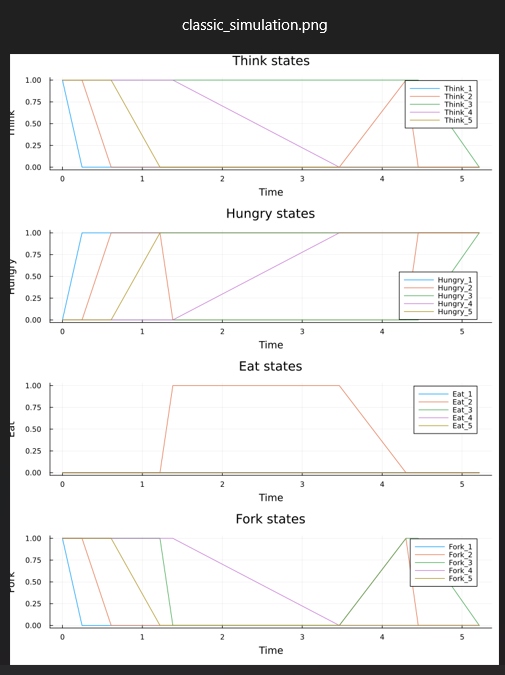{#fig-008 width=70%}

## Базовые эксперименты

Создадим производные форматы с помощью скрипта tangle.jl ([рис. @fig-009]).

{#fig-009 width=70%}

## Базовые эксперименты

Запустим файл ipynb в jupyter-notebook ([рис. @fig-010]).

{#fig-010 width=70%}

##  Анимация процесса

Создадим файл scripts/dining_philosophers_animation.jl. Нам это необходимо для наглядной демонстрации динамики работы сети Петри во времени. Также анимация позволяет увидеть, как меняется маркировка (фишки) в каждой
позиции, и особенно наглядно показывает возникновение deadlock в классической модели.([рис. @fig-011]).

{#fig-011 width=70%}

##  Анимация процесса

Вставляем скрипт ([рис. @fig-012]).

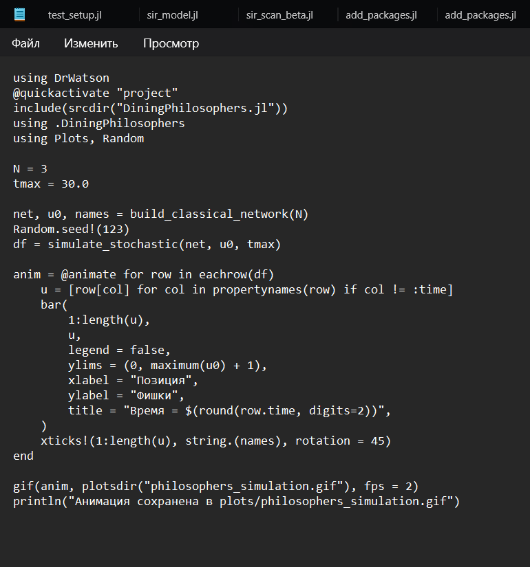{#fig-012 width=70%}

##  Анимация процесса

Запустим скрипт ([рис. @fig-013]).

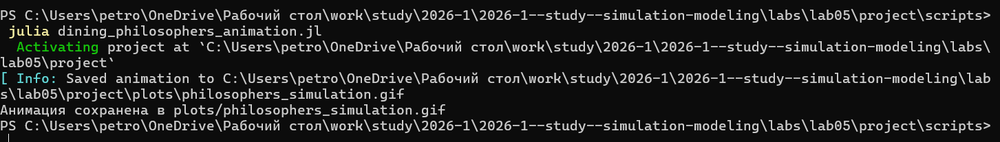{#fig-013 width=70%}

##  Анимация процесса

Просмотрим результирующую гифку ([рис. @fig-014]).

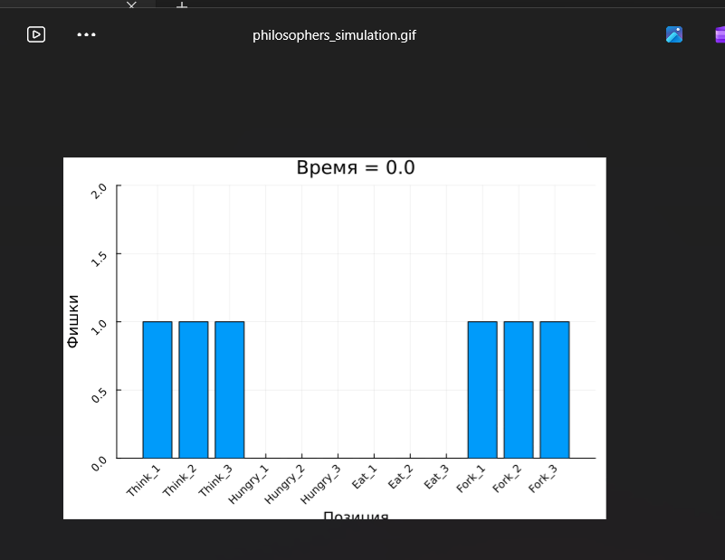{#fig-014 width=70%}

##  Анимация процесса

Создадим производные форматы с помощью скрипта tangle.jl ([рис. @fig-015]).

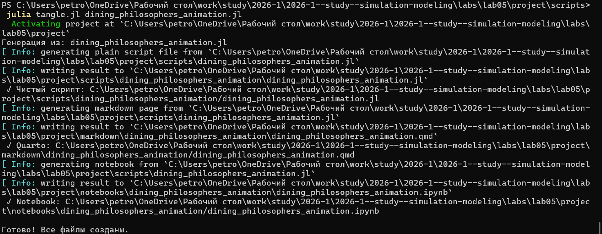{#fig-015 width=70%}

##  Анимация процесса

Запустим файл ipynb в jupyter-notebook ([рис. @fig-016]).

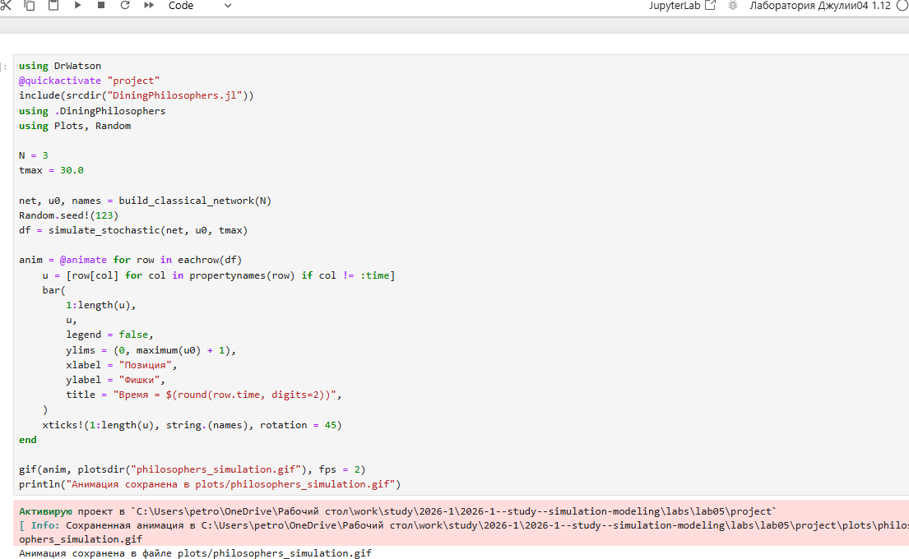{#fig-016 width=70%}

## Итоговый отчёт

Создадим файл scripts/dining_philosophers_report.jl. Он нужен для сравнительного анализа двух моделей (с арбитром и без) по одному ключевому показателю — числу философов, находящихся в состоянии «Ест» ([рис. @fig-017]).

{#fig-017 width=70%}

## Итоговый отчёт

Запустим скрипт ([рис. @fig-018]).

{#fig-018 width=70%}

## Итоговый отчёт

Просмотрим результирующее изображение final_report.png ([рис. @fig-019]).

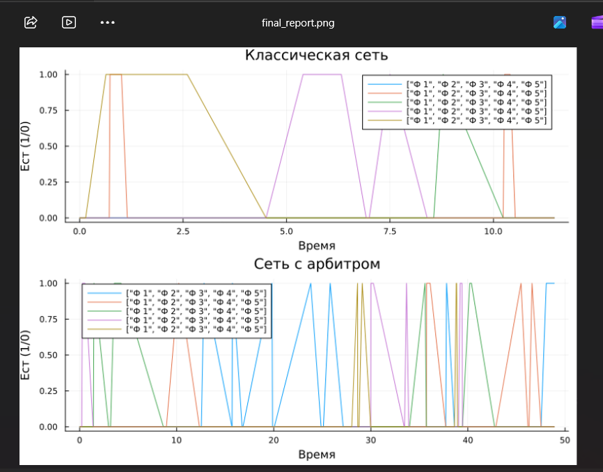{#fig-019 width=70%}

## Итоговый отчёт

Создадим производные форматы с помощью скрипта tangle.jl ([рис. @fig-020]).

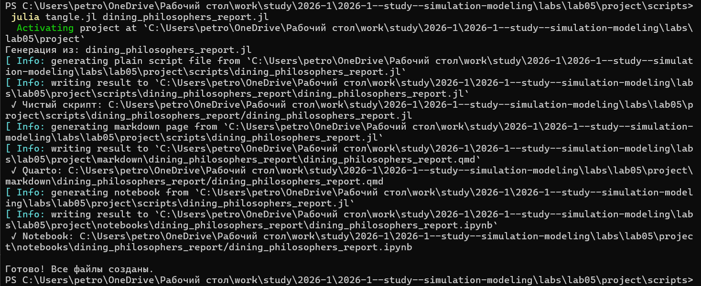{#fig-020 width=70%}

## Итоговый отчёт

Запустим файл ipynb в jupyter-notebook ([рис. @fig-021]).

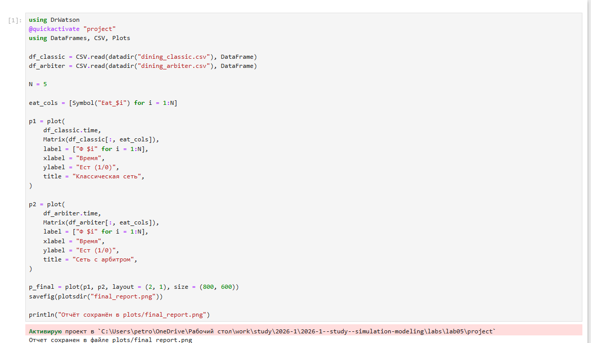{#fig-021 width=70%}

## Выводы

 В ходе выполнения данной лабораторной работы был проведён анализ задачи об обедающих философах с использованием аппарата сетей Петри. Аппарат сетей Петри является эффективным инструментом для моделирования и анализа параллельных систем, позволяющим наглядно выявлять проблемы синхронизации (такие как deadlock) и находить способы их предотвращения.