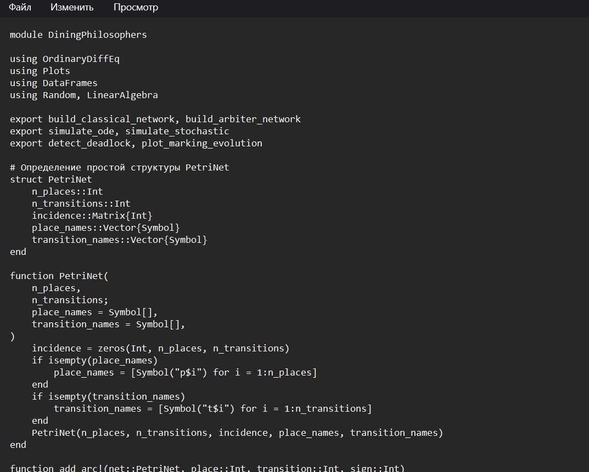
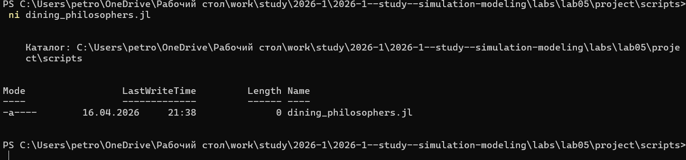
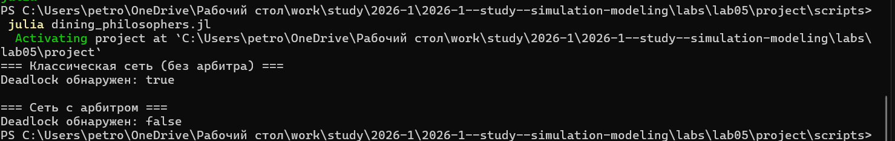
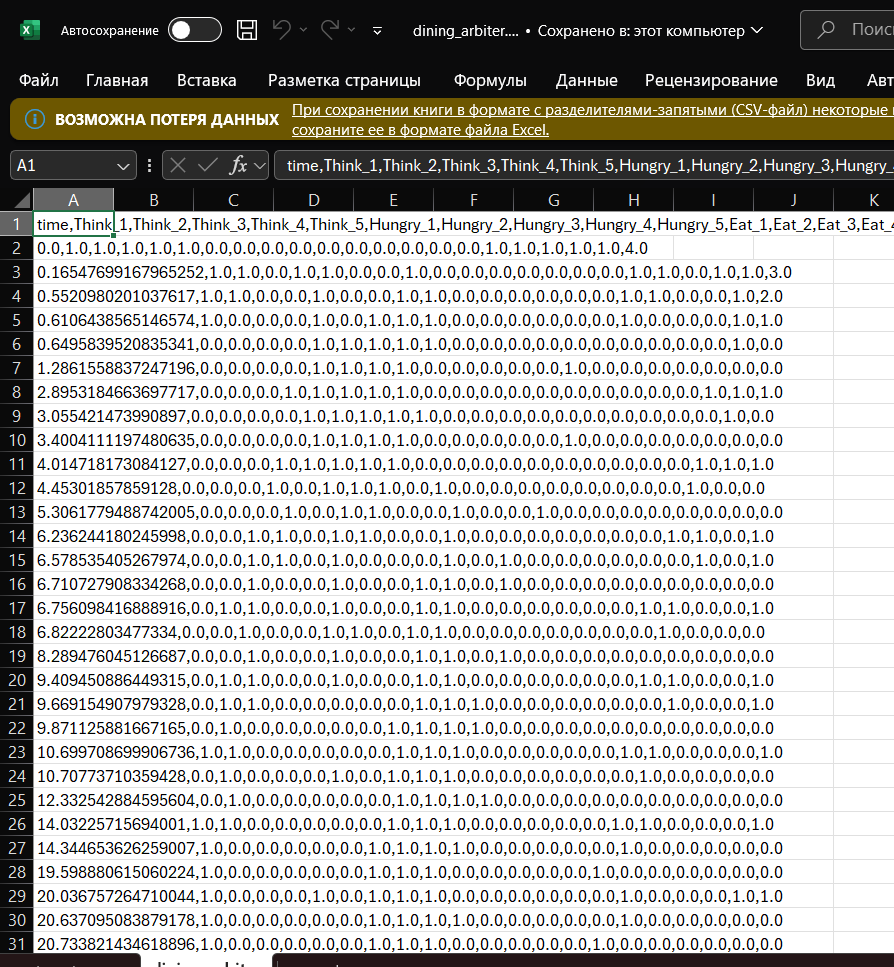
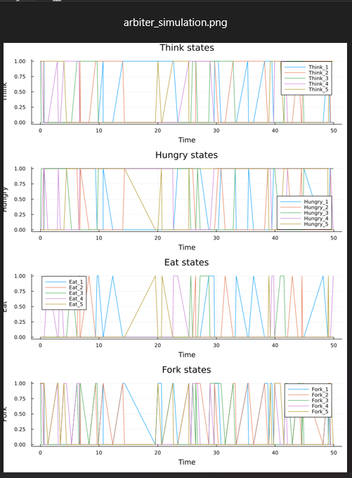
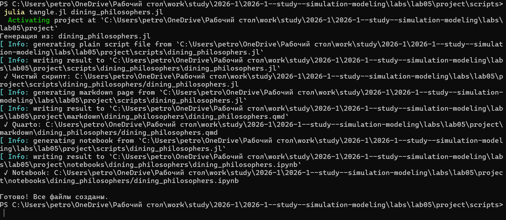
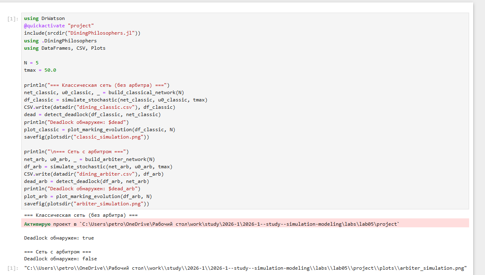
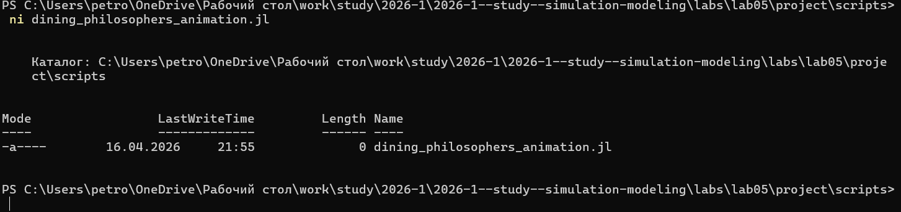
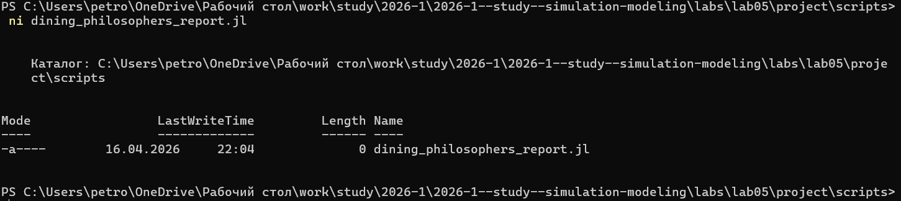
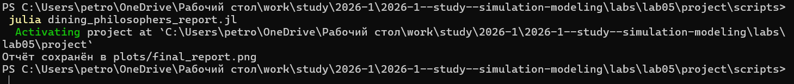

---
## Author
author:
  name: Петрова Алевтина Александровна
  email: 1132236047@rudn.ru
  affiliation:
    - name: Российский университет дружбы народов
      country: Российская Федерация
      postal-code: 117198
      city: Москва
      address: ул. Миклухо-Маклая, д. 6

## Title
title: "Отчёт по лабораторной работе №5"
subtitle: "Имитационное моделирование"
license: "CC BY"
---

# Теоретическое введение

## 5.1.1 Аппарат сетей Петри: История создания

Первую идею сетей Петри Карл Адам Петри сформулировал в возрасте 13 лет
для описания химических реакций. Официальной датой рождения теории считается 1962 год, когда он защитил докторскую диссертацию «Kommunikation mit
Automaten» («Взаимодействие с автоматами») в Боннском университете. За свою
работу он получил премию Тьюринга (ACM Turing Award) — высшую награду в
области информатики

## 5.1.2 Общая информация:

Сеть Петри есть математический аппарат для моделирования дискретных систем.
Графически она представляется как двудольный ориентированный граф двух
типов вершин: позиции (круги) и переходы (прямоугольники).
— Позиции (Places) суть пассивные элементы, описывающие состояние системы
(например, наличие ресурса или выполнение условия).
— Внутри позиции могут находиться фишки (tokens) — неотрицательное целое
число, указывающее на количество ресурсов.
— Переходы (Transitions) суть активные элементы, описывающие события или
действия системы.
— Они могут срабатывать, изменяя состояние модели.
— Дуги (Arcs) суть направленные соединения между позициями и переходами
(но не между двумя позициями или двумя переходами), которые показывают,
как состояние влияет на события и наоборот.
— Маркировка (Marking) есть распределение фишек по позициям в определённый момент времени, то есть текущее состояние модели.
— Смена маркировок происходит при срабатывании переходов в соответствии
с определёнными правилами.
Теория сетей Петри, появившаяся как инструмент для анализа химических процессов, сегодня является мощным и наглядным математическим аппаратом. Она
незаменима везде, где нужно описать параллельные, асинхронные и распределённые системы. В её основе лежат всего четыре элемента, а богатство поведения
возникает из их комбинации

# Задание

- Создать рабочий каталог для всего курса.
- Создать рабочее пространство для программ в рамках лабораторной работы.
- Выполнить все задания по тексту лабораторной работы.
- Установить необходимые пакеты.
- Выполнить предложенный код.
- Преобразовать код в литературный стиль.
- Сгенерировать из литературного кода:
	- чистый код;
	- jupyter notebook;
	- документацию в формате Quarto.
	- Выполнить код из jupyter notebook.
- Интегрировать документацию в формате Quarto в отчёт.
- Добавить в код в литературном стиле вычисление для набора параметров.
- Сгенерировать из литературного кода с параметрами:
	- чистый код;
	- jupyter notebook;
	- документацию в формате Quarto.
- Выполнить код из jupyter notebook с параметрами.
- Интегрировать документацию с параметрами в формате Quarto в отчёт.

# Цель работы

— Построить сеть Петри для пяти философов, моделируя захват и освобождение
вилок.
— Обнаружить состояние взаимной блокировки (deadlock), когда каждый философ взял одну вилку и ждёт вторую.
— Провести имитационное моделирование (стохастическое и детерминированное) и выявить наличие deadlock.
— Модифицировать сеть, чтобы предотвратить deadlock.
— Проанализировать результаты и оформить отчёт с графиками и анимацией.

# Выполнение лабораторной работы

## Код модели

Предварительно создав рабочий каталог для выполнения лабораторной работы, создадим файл src/DiningPhilosophers.jl с описанием базовой модели ([рис. @fig-001]).

{#fig-001 width=70%}

Вставляем скрипт в файл ([рис. @fig-002])

{#fig-002 width=70%}

## Базовые эксперименты

Создадим файл scripts/dining_philosophers.jl. Скрипт выполняет основное моделирование и сравнение двух вариантов сети
Петри:
— классическая модель (без арбитра), в которой возможна взаимная блокировка
(deadlock);
— модифицированная модель с арбитром, которая должна предотвращать
deadlock.  ([рис. @fig-003]).

{#fig-003 width=70%}

Запустим скрипт ([рис. @fig-004]).

{#fig-004 width=70%}

Посмотрим результирующую таблицу dining_arbiter.csv ([рис. @fig-005]).

{#fig-005 width=70%}

Посмотрим результирующую таблицу dining_classic.csv ([рис. @fig-006]).

{#fig-006 width=70%}

Смотрим результирующее изображение arbiter_simulation.png ([рис. @fig-007]).

{#fig-007 width=70%}

Смотрим результирующее изображение classic_simulation.png ([рис. @fig-008]).

{#fig-008 width=70%}

Создадим производные форматы с помощью скрипта tangle.jl ([рис. @fig-009]).

{#fig-009 width=70%}

Запустим файл ipynb в jupyter-notebook ([рис. @fig-010]).

{#fig-010 width=70%}



##  Анимация процесса

Создадим файл scripts/dining_philosophers_animation.jl. Нам это необходимо для наглядной демонстрации динамики работы сети Петри во времени. Также анимация позволяет увидеть, как меняется маркировка (фишки) в каждой
позиции, и особенно наглядно показывает возникновение deadlock в классической модели.([рис. @fig-011]).

{#fig-011 width=70%}

Вставляем скрипт ([рис. @fig-012]).

{#fig-012 width=70%}

Запустим скрипт ([рис. @fig-013]).

{#fig-013 width=70%}

Просмотрим результирующую гифку ([рис. @fig-014]).

{#fig-014 width=70%}

Создадим производные форматы с помощью скрипта tangle.jl ([рис. @fig-015]).

{#fig-015 width=70%}

Запустим файл ipynb в jupyter-notebook ([рис. @fig-016]).

{#fig-016 width=70%}

## Итоговый отчёт

Создадим файл scripts/dining_philosophers_report.jl. Он нужен для сравнительного анализа двух моделей (с арбитром и без) по одному ключевому показателю — числу философов, находящихся в состоянии «Ест» ([рис. @fig-017]).

{#fig-017 width=70%}

Запустим скрипт ([рис. @fig-018]).

{#fig-018 width=70%}

Просмотрим результирующее изображение final_report.png ([рис. @fig-019]).

{#fig-019 width=70%}

Создадим производные форматы с помощью скрипта tangle.jl ([рис. @fig-020]).

{#fig-020 width=70%}

Запустим файл ipynb в jupyter-notebook ([рис. @fig-021]).

{#fig-021 width=70%}



# Выводы

 В ходе выполнения данной лабораторной работы был проведён анализ задачи об обедающих философах с использованием аппарата сетей Петри. Аппарат сетей Петри является эффективным инструментом для моделирования и анализа параллельных систем, позволяющим наглядно выявлять проблемы синхронизации (такие как deadlock) и находить способы их предотвращения.

# Список литературны

1. Петри К. А. Kommunikation mit Automaten : дис. … д-ра наук : 004.7 / Петри Карл Адам ; Боннский университет. — Бонн, 1962. — 128 с.

2. Питерсон Дж. Л. Теория сетей Петри и моделирование систем = Petri Net Theory and the Modeling of Systems / Дж. Л. Питерсон ; пер. с англ. В. А. Горбатова ; под ред. В. А. Горбатова. — Москва : Мир, 1984. — 264 с. — ISBN 5-03-000420-0.

3. Мур Э. Ф. Сети Петри: теория и применение / Э. Ф. Мур ; пер. с англ. А. А. Соколова ; под ред. Ю. И. Янова. — Москва : Мир, 1984. — 320 с.

4. Зайцев Д. А. Сети Петри: моделирование и анализ дискретных систем / Д. А. Зайцев. — Одесса : ОНПУ, 2004. — 180 с.

5. Datseris G. Agents.jl: a performant and feature-full agent-based modeling software of minimal code complexity / G. Datseris, A. R. Vahdati, T. C. DuBois // SIMULATION. — 2022. — P. 003754972110688.

6. Kermack W. O. A Contribution to the Mathematical Theory of Epidemics / W. O. Kermack, A. G. McKendrick // Proceedings of the Royal Society of London. Series A. — 1927. — Vol. 115, no. 772. — P. 700–721.

7. Watson A. J. Biological homeostasis of the global environment: the parable of Daisyworld / A. J. Watson, J. E. Lovelock // Tellus B: Chemical and Physical Meteorology. — 1983. — Vol. 35, no. 4. — P. 284.