---
## Author
author:
  name: Петрова Алевтина Александровна
  email: 1132236047@rudn.ru
  affiliation:
    - name: Российский университет дружбы народов
      country: Российская Федерация
      postal-code: 117198
      city: Москва
      address: ул. Миклухо-Маклая, д. 6
## Title
title: Презентация Лабораторной работы №6
subtitle: Имитационное моделирование
license: CC BY
date: today
date-format: "YYYY-MM-DD" # Example: 2025-09-06
---

## Цель работы

Целью данной лабораторной работы является реализация модели эпидемии SIR с использованием сетей Петри и анализ результата действия данной модели.

## Выполнение лабораторной работы

Первым делом проверяю, что все юазовые пакеты для лабораторной работы устанрвлены ([рис. @fig-001]).

{#fig-001 width=70%}

## Код модели

Создадим файл src/SIRPetri.jl с реализацией вычислительной логики модели ([рис. @fig-002]).

{#fig-002 width=70%}

## Базовый прогон модели

Создадим файл scripts/sirpetri_run.jl. Скрипт выполняет один базовый эксперимент с фиксированными параметрами и запускает два типа симуляции: детерминированную (решение ОДУ - даёт плавную усреднённую динамику) и стохастическую (Алгоритм Гиллеспи) - учитывает случайные флуктуации ([рис. @fig-003])

{#fig-003 width=70%}

## Базовый прогон модели

Вставляем скрипт ([рис. @fig-004]).

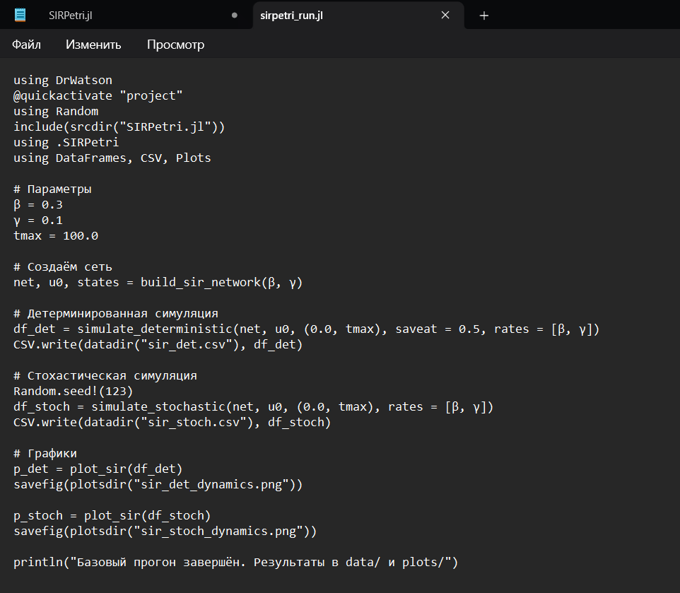{#fig-004 width=70%}

## Базовый прогон модели

Запускаем скрипт ([рис. @fig-005]).

{#fig-005 width=70%}

## Базовый прогон модели

Создадим производные форматы с помощью скрипта tangle.jl ([рис. @fig-006]).

{#fig-006 width=70%}

## Базовый прогон модели

Запустим файл ipynb в jupyter-notebook ([рис. @fig-007]).

{#fig-007 width=70%}

## Базовый прогон модели

Смотрим первое результирующее изображение ([рис. @fig-008]).

{#fig-008 width=70%}

## Базовый прогон модели

Смотрим второе результирующее изображение ([рис. @fig-009]).

{#fig-009 width=70%}

## Базовый прогон модели

Смотрим первую результирующую таблицу sir_det.csv([рис. @fig-010]).

{#fig-010 width=70%}

## Базовый прогон модели

Смотрим вторую результирующую таблицу sir_stoch.csv([рис. @fig-011]).

{#fig-011 width=70%}

## Коэффициент заражения β

Создадим файл scripts/sirpetri_scan_parameters.jl. Скрипт исследует чувствительность модели к изменению параметра β (скорости заражения). Для каждого значения β из диапазона 0.1:0.05:0.8 запускается детерминированная симуляция (γ = 0.1 фиксирован). Для каждого прогона вычисляются: максимальное число инфицированных (пик эпидемии) – peak_I и конечное число выздоровевших – final_R ([рис. @fig-007]).([рис. @fig-012]).

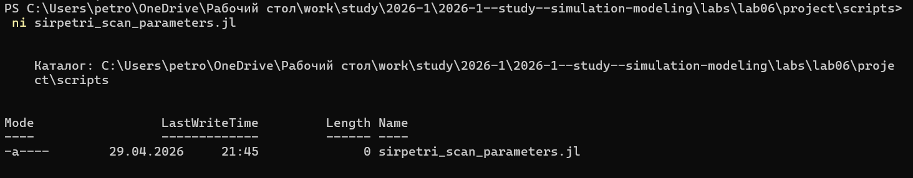{#fig-012 width=70%}

## Коэффициент заражения β

Вставляем скрипт([рис. @fig-013]).

{#fig-013 width=70%}

## Коэффициент заражения β

Запускаем скрипт ([рис. @fig-014]).

{#fig-014 width=70%}

## Коэффициент заражения β

Смотрим результирующий график ([рис. @fig-015]).

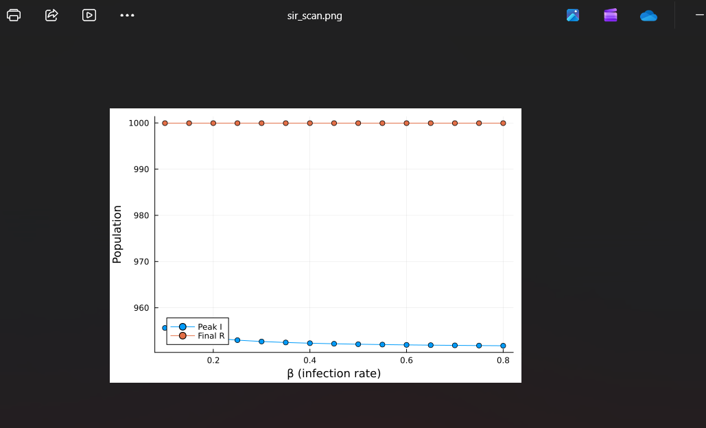{#fig-015 width=70%}

## Коэффициент заражения β

Смотрим результирующую таблицу ([рис. @fig-016]).

{#fig-016 width=70%}

## Коэффициент заражения β

Создадим производные форматы с помощью скрипта tangle.jl ([рис. @fig-017])

{#fig-017 width=70%}

## Коэффициент заражения β

Запустим файл ipynb в jupyter-notebook ([рис. @fig-018]).

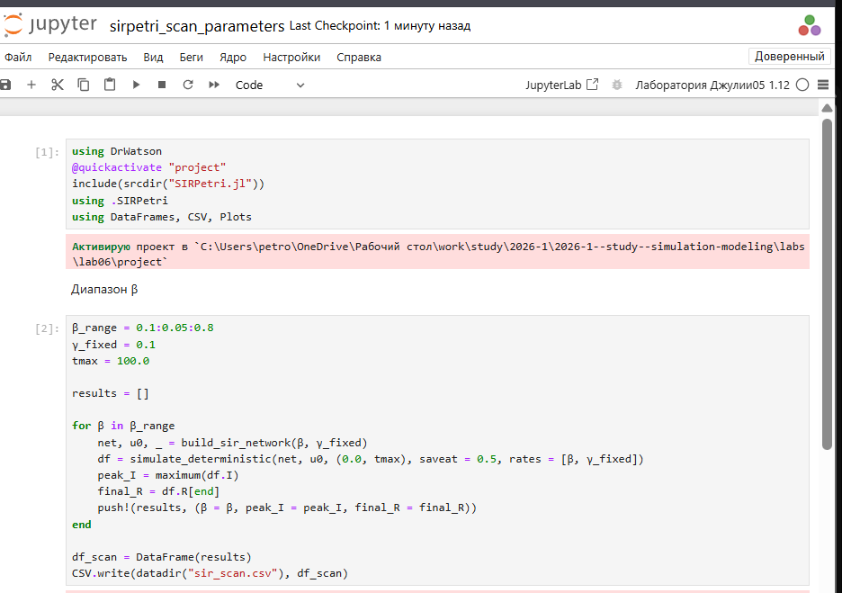{#fig-018 width=70%}

## Анимация детерминированной динамики

Создадим файл scripts/sirpetri_animate.jl. Скрипт создаёт GIF-анимацию, показывающую, как со временем меняется количество людей в каждой из трёх групп (S,I,R). Анимация позволяет наглядно увидеть распространение эпидемии, пик и спад ([рис. @fig-019]).

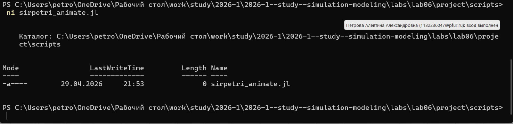{#fig-019 width=70%}

## Анимация детерминированной динамики

Вставляем скрипт ([рис. @fig-020]).

{#fig-020 width=70%}

## Анимация детерминированной динамики

Запускаем скрипт ([рис. @fig-021]).

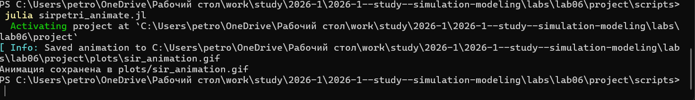{#fig-021 width=70%}

## Анимация детерминированной динамики

Просмотрим результирующий gif-файл. ([рис. @fig-022]).

{#fig-022 width=70%}

## Анимация детерминированной динамики

Создадим производные форматы с помощью скрипта tangle.jl ([рис. @fig-023])

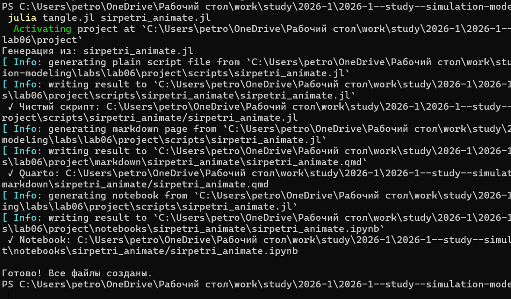{#fig-023 width=70%}

## Анимация детерминированной динамики

Запустим файл ipynb в jupyter-notebook ([рис. @fig-024]).

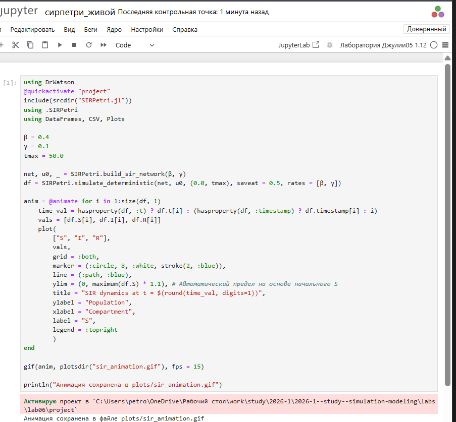{#fig-024 width=70%}

## Итоговый отчёт

Создадим файл scripts/sirpetri_report.jl. Скрипт загружает ранее сохранённые результаты (sir_det.csv, sir_stoch.csv, sir_scan.csv) и строит сравнительные графики для итогового отчёта ([рис. @fig-025]).

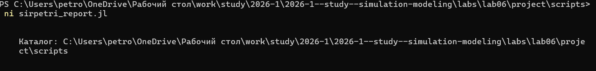{#fig-025 width=70%}

## Итоговый отчёт

Вставляем скрипт ([рис. @fig-026]).

{#fig-026 width=70%}

## Итоговый отчёт

Запускаем скрипт ([рис. @fig-027])

{#fig-027 width=70%}

## Итоговый отчёт

Просмотрим результирующие графики. ([рис. @fig-028]) и ([рис. @fig-029])

{#fig-028 width=70%}

## Итоговый отчёт

{#fig-029 width=70%}

## Итоговый отчёт

Создадим производные форматы с помощью скрипта tangle.jl ([рис. @fig-030])

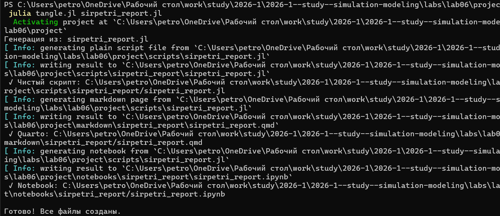{#fig-030 width=70%}

## Итоговый отчёт

Запустим файл ipynb в jupyter-notebook ([рис. @fig-031]).

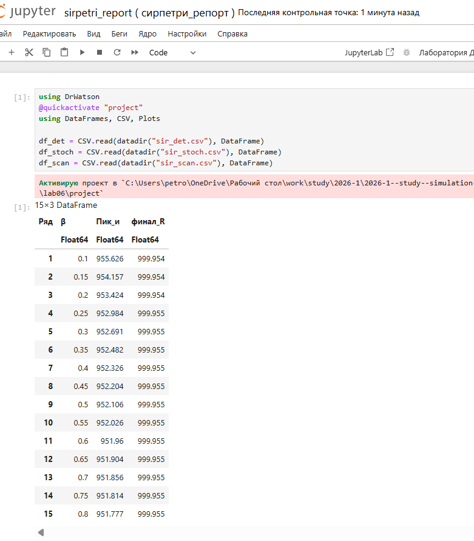{#fig-031 width=70%}

## Выводы

В ходе данной лабораторной работы мной была реализована модель эпидемии SIR с использованием сетей Петри и проанализирован результат действия данной модели.
