---
## Author
author:
  name: Петрова Алевтина Александровна
  email: 1132236047@rudn.ru
  affiliation:
    - name: Российский университет дружбы народов
      country: Российская Федерация
      postal-code: 117198
      city: Москва
      address: ул. Миклухо-Маклая, д. 6

## Title
title: "Отчёт по лабораторной работе №6"
subtitle: "Имитационное моделирование"
license: "CC BY"
---

# Задание

- Создать рабочий каталог для всего курса.
- Создать рабочее пространство для программ в рамках лабораторной работы.
- Выполнить все задания по тексту лабораторной работы.
- Установить необходимые пакеты.
- Выполнить предложенный код.
- Преобразовать код в литературный стиль.
- Сгенерировать из литературного кода:
	- чистый код;
	- jupyter notebook;
	- документацию в формате Quarto.
	- Выполнить код из jupyter notebook.
- Интегрировать документацию в формате Quarto в отчёт.
- Добавить в код в литературном стиле вычисление для набора параметров.
- Сгенерировать из литературного кода с параметрами:
	- чистый код;
	- jupyter notebook;
	- документацию в формате Quarto.
- Выполнить код из jupyter notebook с параметрами.
- Интегрировать документацию с параметрами в формате Quarto в отчёт.

# Цель работы

Целью данной лабораторной работы является реализация модели эпидемии SIR с использованием сетей Петри и анализ результата действия данной модели.

# Теоретическое введение

Реализована модель эпидемии SIR (Susceptible–Infectious–Recovered) с использованием сетей Петри. Модель описывает переходы между тремя состояниями:
— 𝑆 (восприимчивые) — могут заразиться;
— 𝐼 (инфицированные) — заражают других и выздоравливают;
— 𝑅 (выздоровевшие / с иммунитетом) — больше не участвуют в эпидемии.
Сеть Петри содержит два перехода:
— infection: 𝑆 + 𝐼 → 𝐼 + 𝐼 (скорость β);
— recovery: 𝐼 → 𝑅 (скорость γ).

# Выполнение лабораторной работы

Первым делом проверяю, что все юазовые пакеты для лабораторной работы устанрвлены ([рис. @fig-001]).

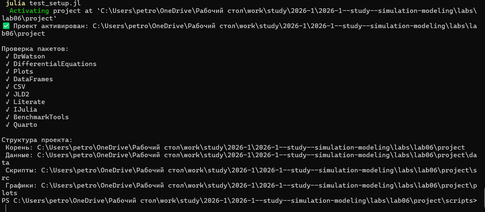{#fig-001 width=70%}

## Код модели

Создадим файл src/SIRPetri.jl с реализацией вычислительной логики модели ([рис. @fig-002]).

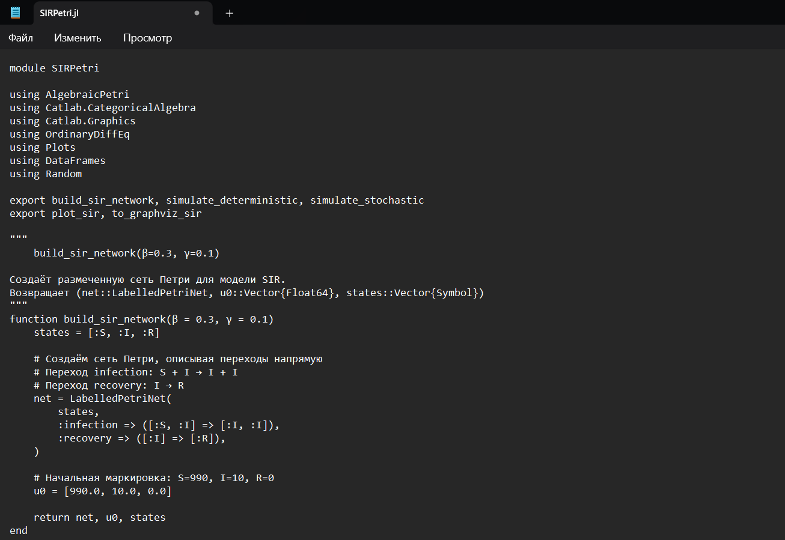{#fig-002 width=70%}

##Базовый прогон модели

Создадим файл scripts/sirpetri_run.jl. Скрипт выполняет один базовый эксперимент с фиксированными параметрами и запускает два типа симуляции: детерминированную (решение ОДУ - даёт плавную усреднённую динамику) и стохастическую (Алгоритм Гиллеспи) - учитывает случайные флуктуации ([рис. @fig-003])

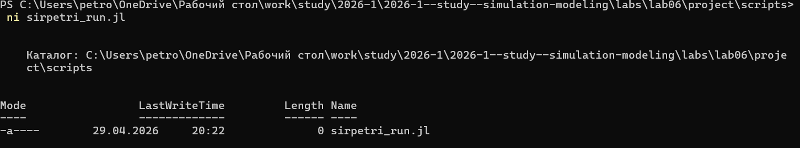{#fig-003 width=70%}

Вставляем скрипт ([рис. @fig-004]).

{#fig-004 width=70%}

Запускаем скрипт ([рис. @fig-005]).

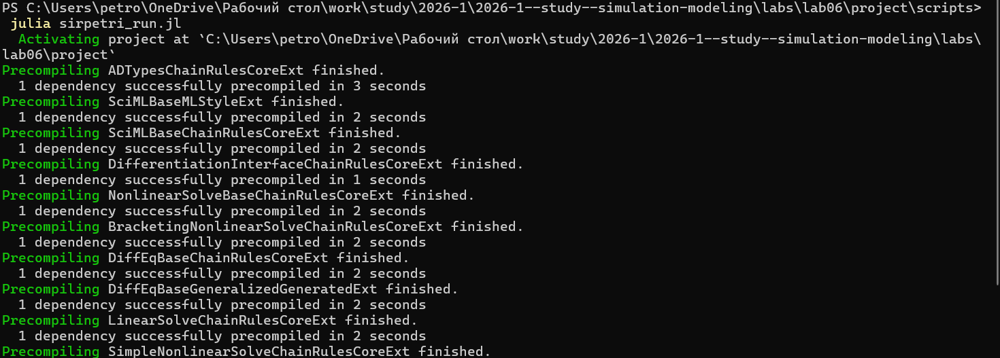{#fig-005 width=70%}

Создадим производные форматы с помощью скрипта tangle.jl ([рис. @fig-006]).

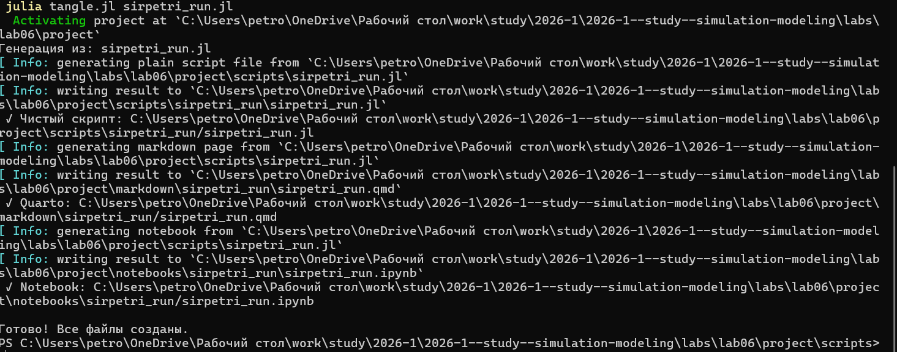{#fig-006 width=70%}

Запустим файл ipynb в jupyter-notebook ([рис. @fig-007]).

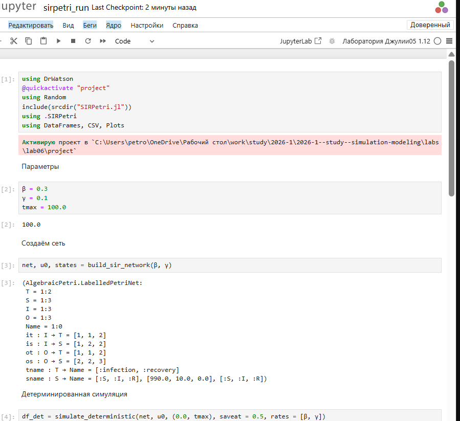{#fig-007 width=70%}

Смотрим первое результирующее изображение ([рис. @fig-008]).

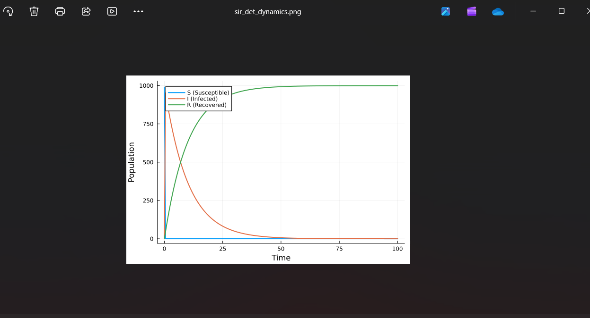{#fig-008 width=70%}

Смотрим второе результирующее изображение ([рис. @fig-009]).

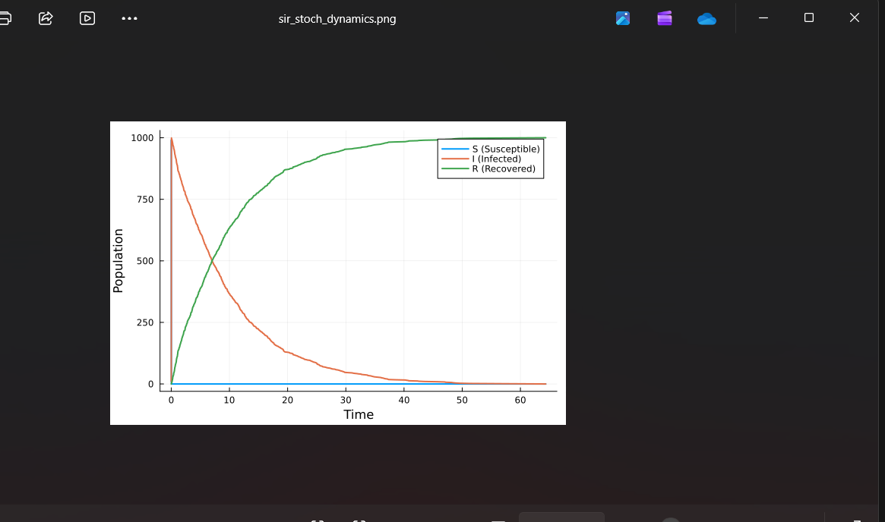{#fig-009 width=70%}

Детерминированный график показывает классический пик эпидемии: рост I, максимум, затем спад до нуля; R растёт и выходит на плато, S падает.
Стохастический график может иметь шумы и, возможно, немного отличаться по времени пика и амплитуде – это демонстрирует влияние случайности.
Сравнение двух типов симуляции показывает, что при большом начальном числе восприимчивых (990) стохастическая траектория близка к детерминированной, но при малых числах различия были бы значительны.

Смотрим первую результирующую таблицу sir_det.csv([рис. @fig-010]).

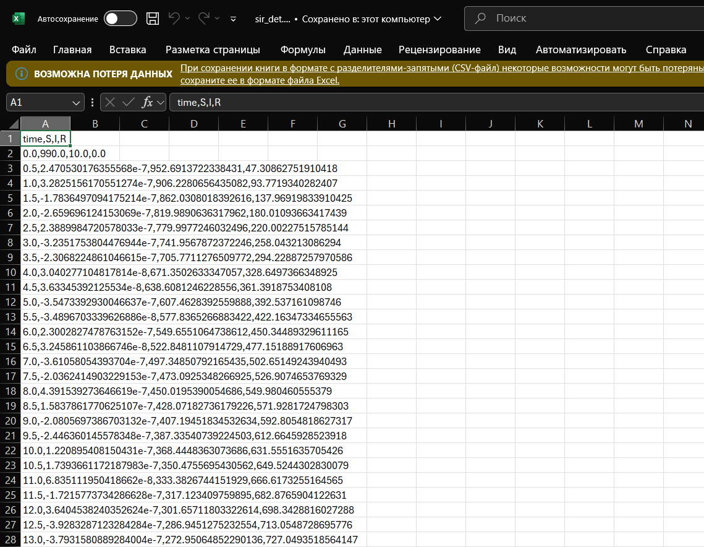{#fig-010 width=70%}

Смотрим вторую результирующую таблицу sir_stoch.csv([рис. @fig-011]).

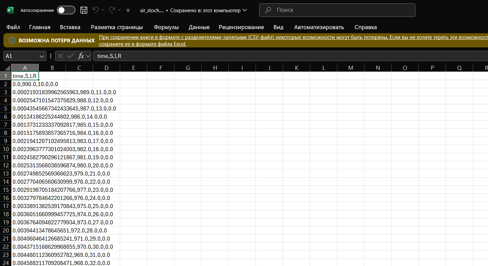{#fig-011 width=70%}

## Коэффициент заражения β

Создадим файл scripts/sirpetri_scan_parameters.jl. Скрипт исследует чувствительность модели к изменению параметра β (скорости заражения). Для каждого значения β из диапазона 0.1:0.05:0.8 запускается детерминированная симуляция (γ = 0.1 фиксирован). Для каждого прогона вычисляются: максимальное число инфицированных (пик эпидемии) – peak_I и конечное число выздоровевших – final_R ([рис. @fig-007]).([рис. @fig-012]).

{#fig-012 width=70%}

Вставляем скрипт([рис. @fig-013]).

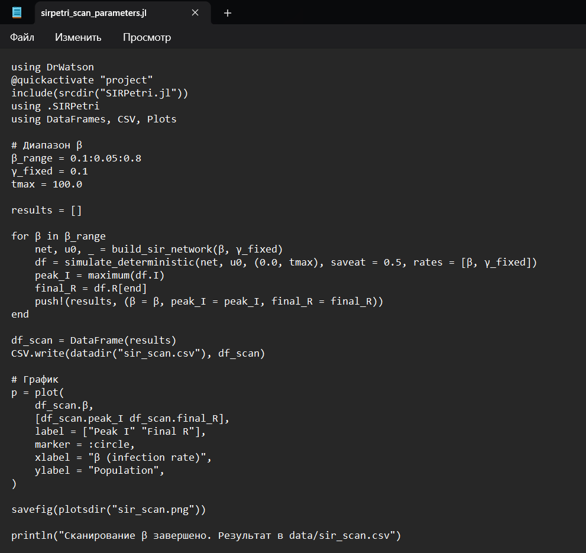{#fig-013 width=70%}

Запускаем скрипт ([рис. @fig-014]).

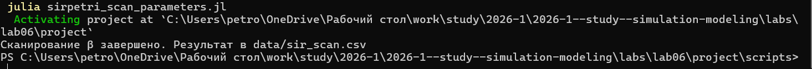{#fig-014 width=70%}

Смотрим результирующий график ([рис. @fig-015]).

{#fig-015 width=70%}

При малых β (например, 0.1) эпидемия не возникает (peak_I ≈ 0, final_R ≈ 0).
С ростом β пик заболеваемости сначала резко растёт, затем достигает насыщения (почти всё население переболевает).
Конечное R(β) также растёт с β, но медленнее; при больших β практически всё население переходит в R.
Такой график демонстрирует пороговое явление, характерное для модели SIR: существует критическое значение β, выше которого возникает вспышка.

Смотрим результирующую таблицу ([рис. @fig-016]).

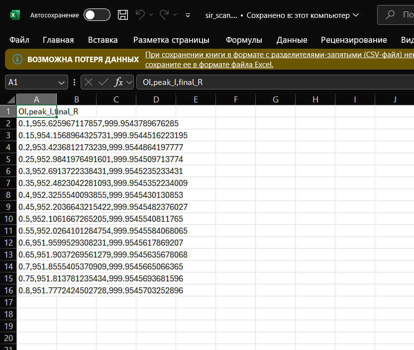{#fig-016 width=70%}

Создадим производные форматы с помощью скрипта tangle.jl ([рис. @fig-017])

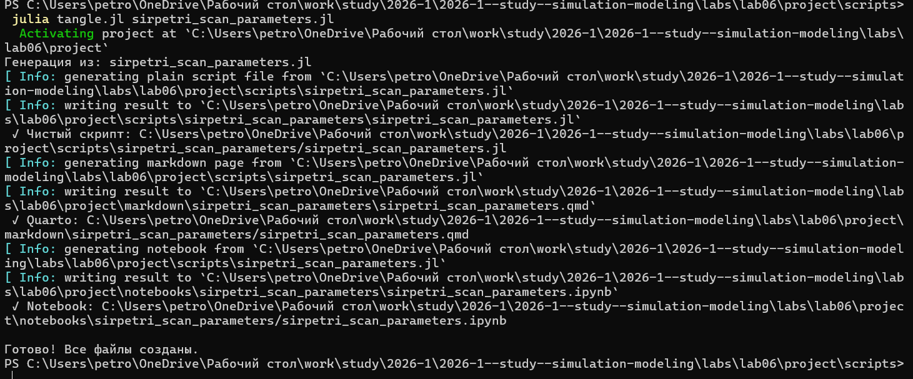{#fig-017 width=70%}

Запустим файл ipynb в jupyter-notebook ([рис. @fig-018]).

{#fig-018 width=70%}

## Анимация детерминированной динамики

Создадим файл scripts/sirpetri_animate.jl. Скрипт создаёт GIF-анимацию, показывающую, как со временем меняется количество людей в каждой из трёх групп (S,I,R). Анимация позволяет наглядно увидеть распространение эпидемии, пик и спад ([рис. @fig-019]).

{#fig-019 width=70%}

Вставляем скрипт ([рис. @fig-020]).

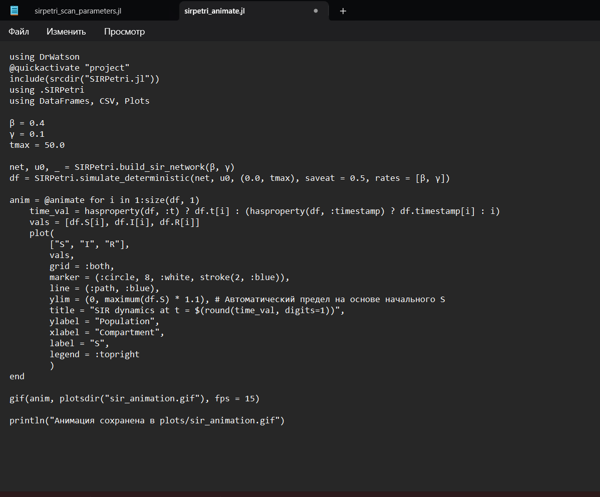{#fig-020 width=70%}

Запускаем скрипт ([рис. @fig-021]).

{#fig-021 width=70%}

Просмотрим результирующий gif-файл. ([рис. @fig-022]).

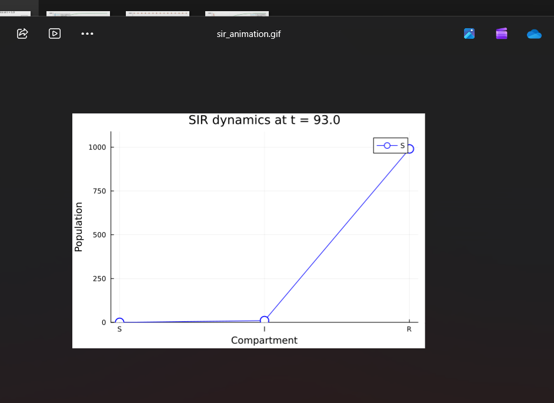{#fig-022 width=70%}

На первых кадрах I растёт, S падает.
В момент пика I достигает максимума, затем снижается, а R растёт.
Анимация даёт динамическое представление о том, как волна инфекции проходит через популяцию.

Создадим производные форматы с помощью скрипта tangle.jl ([рис. @fig-023])

{#fig-023 width=70%}

Запустим файл ipynb в jupyter-notebook ([рис. @fig-024]).

{#fig-024 width=70%}

## Итоговый отчёт

Создадим файл scripts/sirpetri_report.jl. Скрипт загружает ранее сохранённые результаты (sir_det.csv, sir_stoch.csv, sir_scan.csv) и строит сравнительные графики для итогового отчёта ([рис. @fig-025]).

{#fig-025 width=70%}

Вставляем скрипт ([рис. @fig-026]).

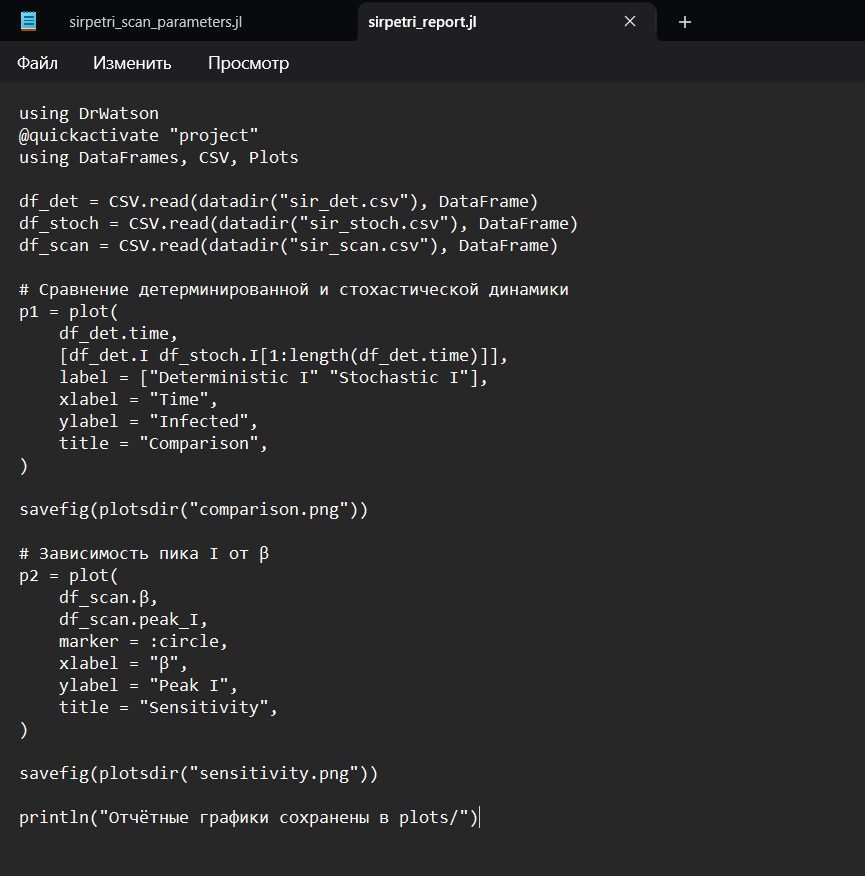{#fig-026 width=70%}

Запускаем скрипт ([рис. @fig-027])

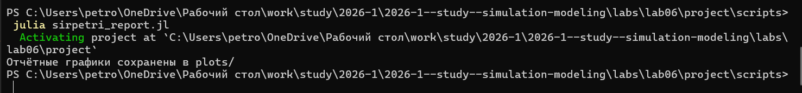{#fig-027 width=70%}

Просмотрим результирующие графики. ([рис. @fig-028]) и ([рис. @fig-029])

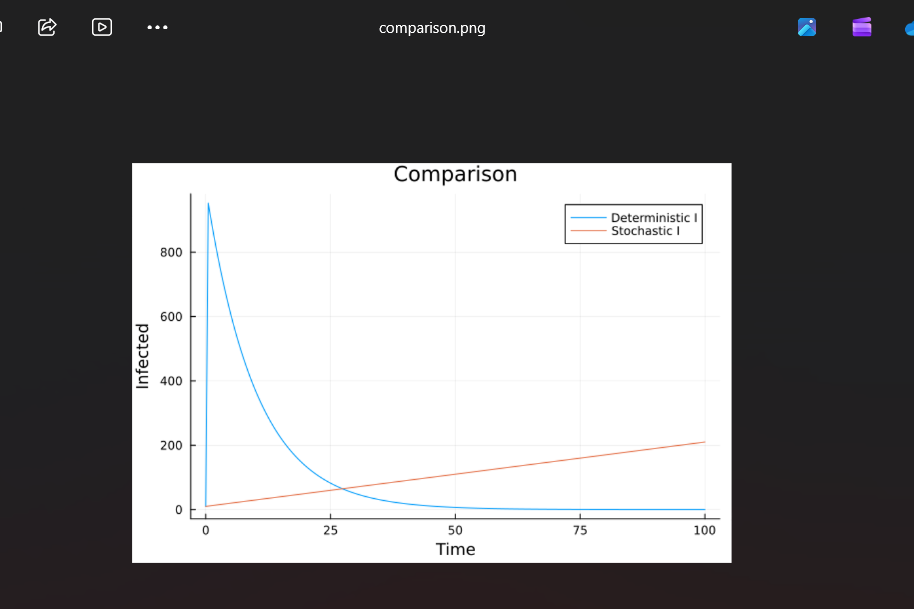{#fig-028 width=70%}

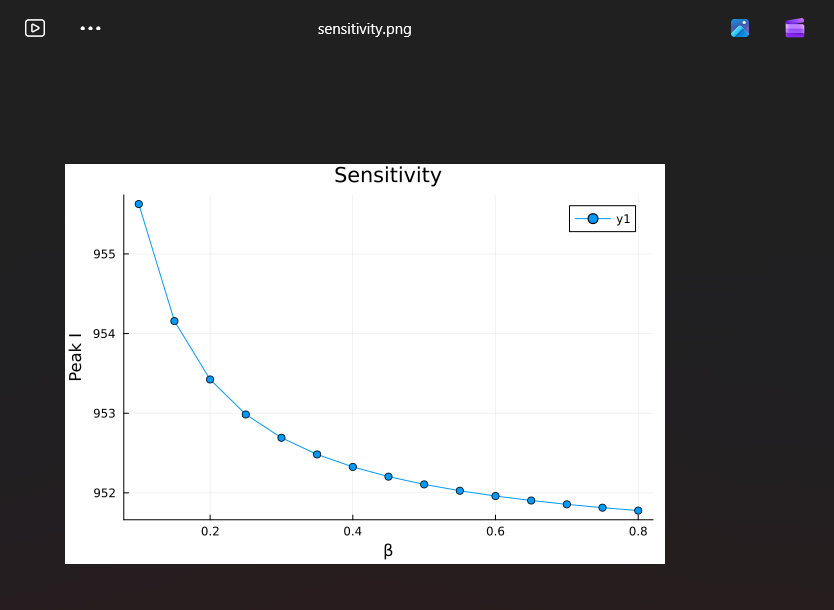{#fig-029 width=70%}

Создадим производные форматы с помощью скрипта tangle.jl ([рис. @fig-030])

{#fig-030 width=70%}

Запустим файл ipynb в jupyter-notebook ([рис. @fig-031]).

{#fig-031 width=70%}

# Выводы

В ходе данной лабораторной работы мной была реализована модель эпидемии SIR с использованием сетей Петри и проанализирован результат действия данной модели.

# Список литературы{.unnumbered}

1. Петри К. А. Kommunikation mit Automaten : диссертация … доктора наук : 004.7 / Петри Карл Адам ; Боннский университет. — Бонн, 1962. — 128 с.

2. Питерсон Дж. Л. Теория сетей Петри и моделирование систем = Petri Net Theory and the Modeling of Systems / Дж. Л. Питерсон ; перевод с английского В. А. Горбатова ; под редакцией В. А. Горбатова. — Москва : Мир, 1984. — 264 с. — ISBN 5-03-000420-0.

3. Мур Э. Ф. Сети Петри: теория и применение / Э. Ф. Мур ; перевод с английского А. А. Соколова ; под редакцией Ю. И. Янова. — Москва : Мир, 1984. — 320 с.

4. Зайцев Д. А. Сети Петри: моделирование и анализ дискретных систем / Д. А. Зайцев. — Одесса : ОНПУ, 2004. — 180 с.

5. Kermack W. O. A Contribution to the Mathematical Theory of Epidemics / W. O. Kermack, A. G. McKendrick // Proceedings of the Royal Society of London. Series A. — 1927. — Vol. 115, no. 772. — P. 700–721.

6. Datseris G. Agents.jl: a performant and feature‑full agent‑based modeling software of minimal code complexity / G. Datseris, A. R. Vahdati, T. C. DuBois // SIMULATION. — 2022. — P. 003754972110688.

7. Watson A. J. Biological homeostasis of the global environment: the parable of Daisyworld / A. J. Watson, J. E. Lovelock // Tellus B: Chemical and Physical Meteorology. — 1983. — Vol. 35, no. 4. — P. 284.

