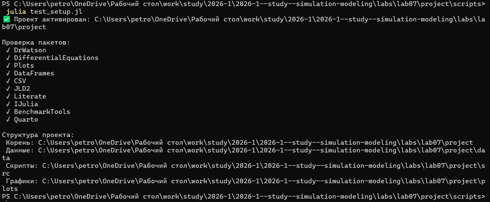
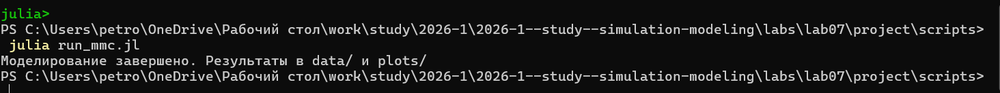
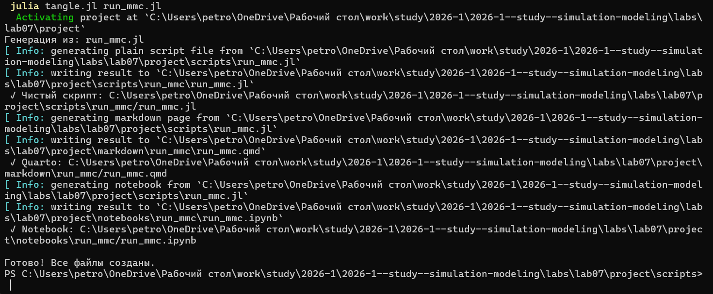
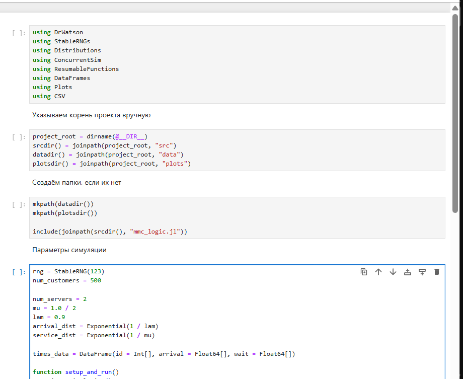
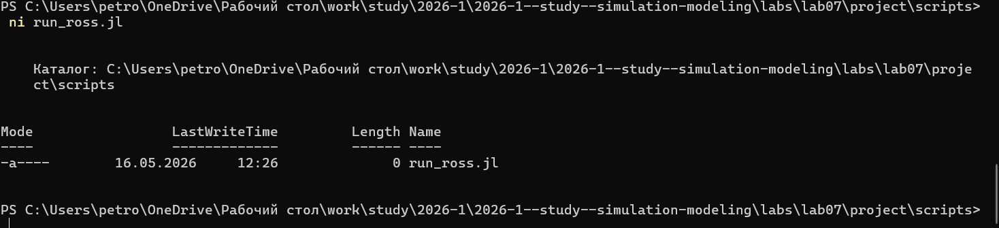
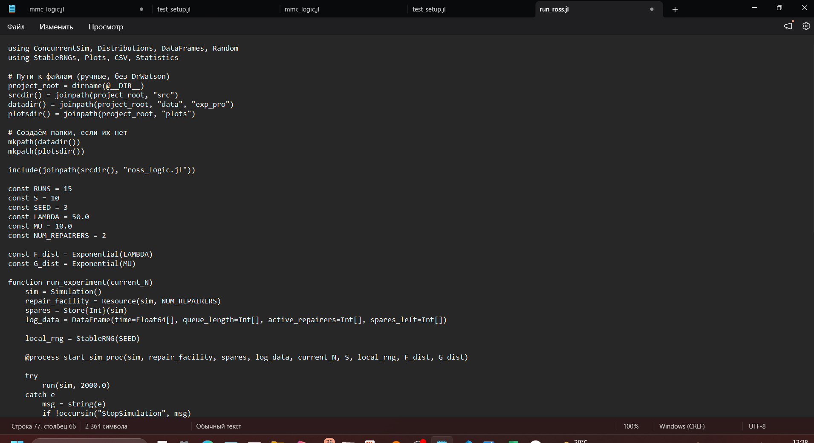
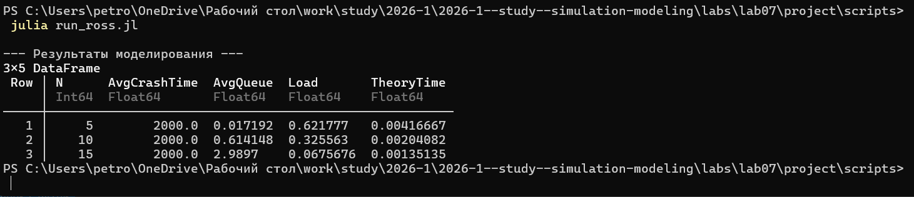

---
## Author
author:
  name: Петрова Алевтина Александровна
  email: 1132236047@rudn.ru
  affiliation:
    - name: Российский университет дружбы народов
      country: Российская Федерация
      postal-code: 117198
      city: Москва
      address: ул. Миклухо-Маклая, д. 6
## Title
title: Презентация Лабораторной работы №7
subtitle: Имитационное Моделирование
license: CC BY
date: today
date-format: "YYYY-MM-DD" # Example: 2025-09-06
---

## Цели моделирования
Имитационное моделирование позволяет исследовать:
* **Среднее время до первого отказа системы (краха)**, когда на складе не остается запасных частей для замены.
* **Динамику уровня запаса** на складе.
* **Загрузку ремонтной базы** и длину очереди на восстановление.

Аналитическое решение для среднего времени до краха системы ($E[T]$) при одном ремонтнике описывается формулой:

$$ E[T] = \frac{1}{N\lambda} \sum_{k=0}^{S} \left(\frac{\mu}{N\lambda}\right)^k $$

## Выполнение лабораторной работы

Предварительно проверим правильность структуры нашего проекта ([рис. @fig-001]).

{#fig-001 width=70%}

## Модель M/M/c

Создадим файл src/mmc_logic.jl с реализацией вычислительной логики модели ([рис. @fig-002]).

{#fig-002 width=70%}

## Модель M/M/c

Создадим файл scripts/run_mmc.jl. Скрипт реализует дискретно-событийную модель для анализа надёжности системы, учитывающую стохастический характер поломок и задержки в очереди на ремонт. В отличие от усреднённых расчётов, имитация фиксирует случайные флуктуации запаса и позволяет эмпирически определить среднее время до краха системы при различных нагрузках $N$ ([рис. @fig-003]).

{#fig-003 width=70%}

## Модель M/M/c

Вставляем скрипт ([рис. @fig-004]).

{#fig-004 width=70%}

## Модель M/M/c

Запустим скрипт ([рис. @fig-005]).

{#fig-005 width=70%}

## Модель M/M/c

Смотрим результирующий график ([рис. @fig-006]).

{#fig-006 width=70%}

## Модель M/M/c

Смотрим результирующую таблицу ([рис. @fig-007]).

{#fig-007 width=70%}

## Модель M/M/c

Создадим производные форматы с помощью скрипта tangle.jl ([рис. @fig-008]).

{#fig-008 width=70%}

## Модель M/M/c

Запустим файл ipynb в jupyter-notebook ([рис. @fig-009]).

{#fig-009 width=70%}

## Модель Росса

Создадим файл src/ross_logic.jl с реализацией вычислительной логики модели ([рис. @fig-010]).

{#fig-010 width=70%}

## Модель Росса

Создадим файл scripts/run_ross.jl. В нём описывается логика модели Росса, где процесс работы каждой машины представлен как последовательность состояний «эксплуатация — ожидание замены — ремонт». Модель имитирует конкуренцию за ограниченный ресурс ремонтной базы и позволяет отследить мгновенное изменение уровня резервного фонда $S$ при возникновении случайных отказов ([рис. @fig-011]).

{#fig-011 width=70%}

## Модель Росса

Вставляем скрипт  ([рис. @fig-012]).

{#fig-012 width=70%}

## Модель Росса

Запустим скрипт ([рис. @fig-013]).

{#fig-013 width=70%}

## Модель Росса

Создадим производные форматы с помощью скрипта tangle.jl ([рис. @fig-014]).

{#fig-014 width=70%}

## Модель Росса

Запустим файл ipynb в jupyter-notebook ([рис. @fig-015]).

{#fig-015 width=70%}

## Выводы

В ходе выполнения данной лабораторной работы мной была реализована имитационная модель Росса с использованием дискретно-событийного моделирования и анализ показателей надежности системы при различных нагрузках.