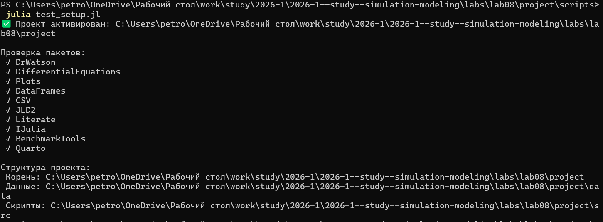
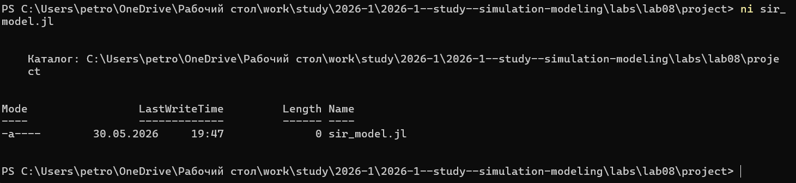
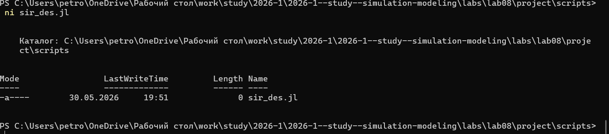
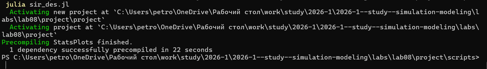
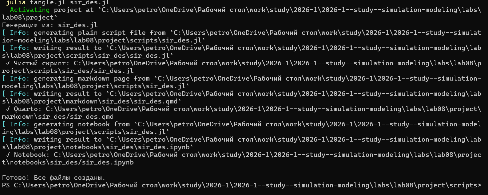
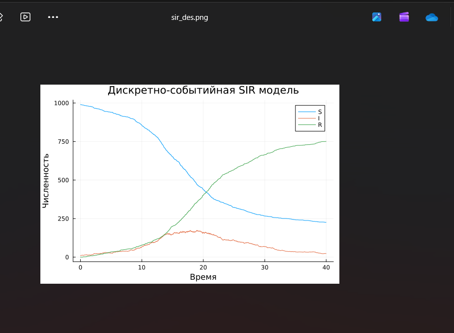
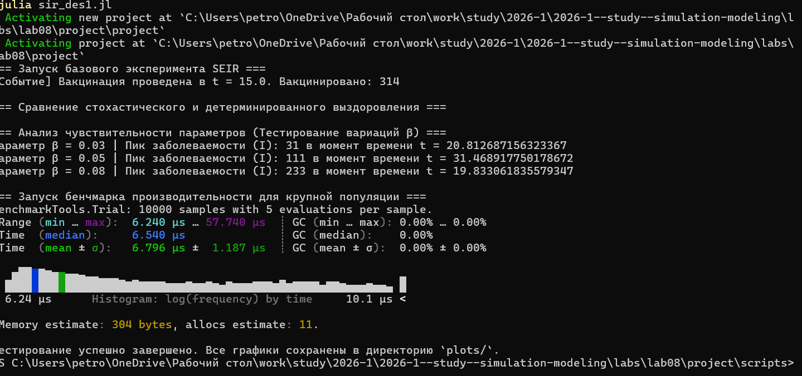
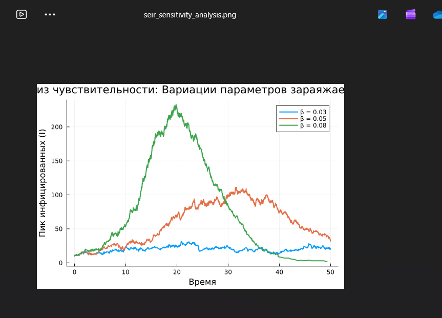

---
## Author
author:
  name: Петрова Алевтина Александровна
  email: 1132236047@rudn.ru
  affiliation:
    - name: Российский университет дружбы народов
      country: Российская Федерация
      postal-code: 117198
      city: Москва
      address: ул. Миклухо-Маклая, д. 6
## Title
title: Презентация Лабораторной работы №8
subtitle: Имитационное Моделирование
license: CC BY
date: today
date-format: "YYYY-MM-DD" # Example: 2025-09-06
---

## Цель работы

Целью данной лабораторной работы является изучить дискретно-событийный подход к имитационному моделированию на примере классической модели распространения инфекции SIR. Реализовать стохастическую дискретно-событийную модель в виде программного комплекса на языке Julia. Провести анализ влияния параметров, сравнить со стохастической и детерминированной версиями, оценить производительность и модифицировать модель.

## Выполнение лабораторной работы

Для начала проверим правильность структуры нашего проекта ([рис. @fig-001]).

{#fig-001 width=70%}

## Работа с изначальным кодом

Создадим файл src/sir_model.jl с реализацией вычислительной логики модели ([рис. @fig-002]).

{#fig-002 width=70%}

## Работа с изначальным кодом

Вставляем код модели ([рис. @fig-003]).

{#fig-003 width=70%}

## Работа с изначальным кодом

Создадим файл scripts/sir_des.jl. Скрипт запуска - он задаёт параметры, инициализирует модель, выполненяет прогон и визуализацию ([рис. @fig-004]).

{#fig-004 width=70%}

## Работа с изначальным кодом

Вставляем скрипт ([рис. @fig-005]).

{#fig-005 width=70%}

## Работа с изначальным кодом

Запустим скрипт ([рис. @fig-006]).

{#fig-006 width=70%}

## Работа с изначальным кодом

Создадим производные форматы с помощью скрипта tangle.jl ([рис. @fig-007]).

{#fig-007 width=70%}

## Работа с изначальным кодом

Запустим файл ipynb в jupyter-notebook ([рис. @fig-008]).

{#fig-008 width=70%}

## Работа с изначальным кодом

Просмотрим результирующий график ([рис. @fig-009]).

{#fig-009 width=70%}

## Внесение изменений

Вносим необходимые изменения: исходная дискретно-событийная модель SIR была переработана и расширена до архитектуры SEIR путем добавления латентного состояния инкубационного периода (`:E`) с экспоненциальной задержкой перехода, а также интеграции эндогенных факторов демографии — непрерывного процесса рождаемости новых восприимчивых агентов и параллельного мониторинга естественной смертности на основе распределения $Exponential(1/\mu_{dem})$. Дополнительно в систему был внедрен дискретный временной триггер вакцинации для таргетированного перевода заданной доли здорового населения в пул `R`, реализована возможность переключения между стохастическим и детерминированным режимами длительности болезни, а сам скрипт симуляции адаптирован под проведение многопараметрического анализа чувствительности к вариациям коэффициента $\beta$ с автоматическим выводом метрик пиковой заболеваемости, профилированием производительности на популяции $N = 10\,000$ с помощью библиотеки `BenchmarkTools` и экспортом траекторий в уникальные CSV-файлы через инструментарий `DrWatson`.

Создаём файл модели src/sir_model1.jl ([рис. @fig-010]).

{#fig-010 width=70%}

## Внесение изменений

Создадим скрипт scripts/sir_des1.jl ([рис. @fig-011]).

{#fig-011 width=70%}

## Внесение изменений

Вставляем скрипт ([рис. @fig-012]).

{#fig-012 width=70%}

## Внесение изменений

Запустим скрипт ([рис. @fig-013]).

{#fig-013 width=70%}

## Внесение изменений

Создадим производные форматы с помощью скрипта tangle.jl ([рис. @fig-014]).

{#fig-014 width=70%}

## Внесение изменений

Запустим файл ipynb в jupyter-notebook ([рис. @fig-015]).

{#fig-015 width=70%}

## Внесение изменений

Просмотрим результирующие графики ([рис. @fig-016], [рис. @fig-017], [рис. @fig-018]).

{#fig-016 width=70%}

## Внесение изменений

{#fig-017 width=70%}

## Внесение изменений

{#fig-018 width=70%}

# Выводы

В ходе выполнения данной лабораторной работы мной был изучен дискретно-событийный подход к имитационному моделированию на примере классической модели распространения инфекции SIR. Реализована стохастическую дискретно-событийную модель в виде программного комплекса на языке Julia и проведён анализ влияния параметров, сравнение со стохастической и детерминированной версиями, так же проведена оценка производительности и модифицирована модель.

