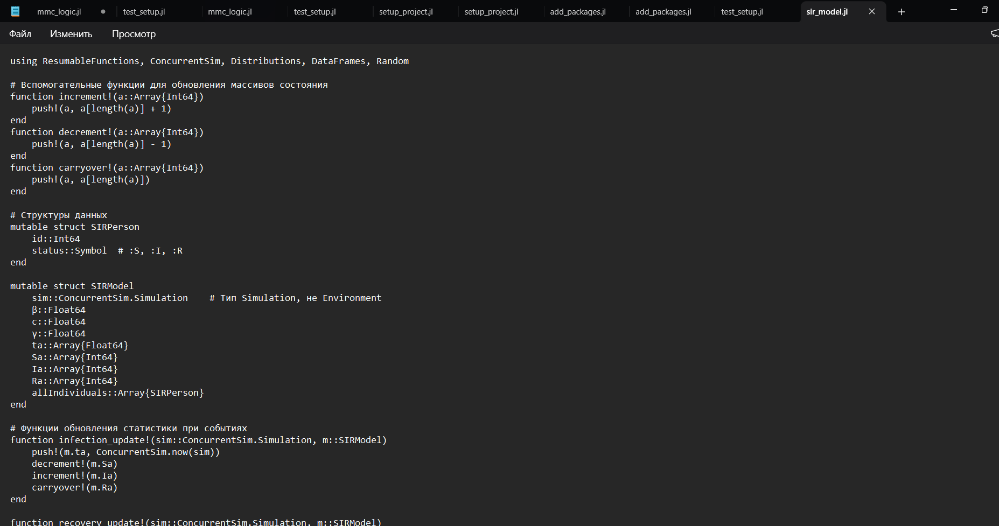
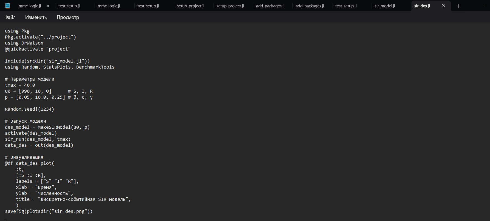
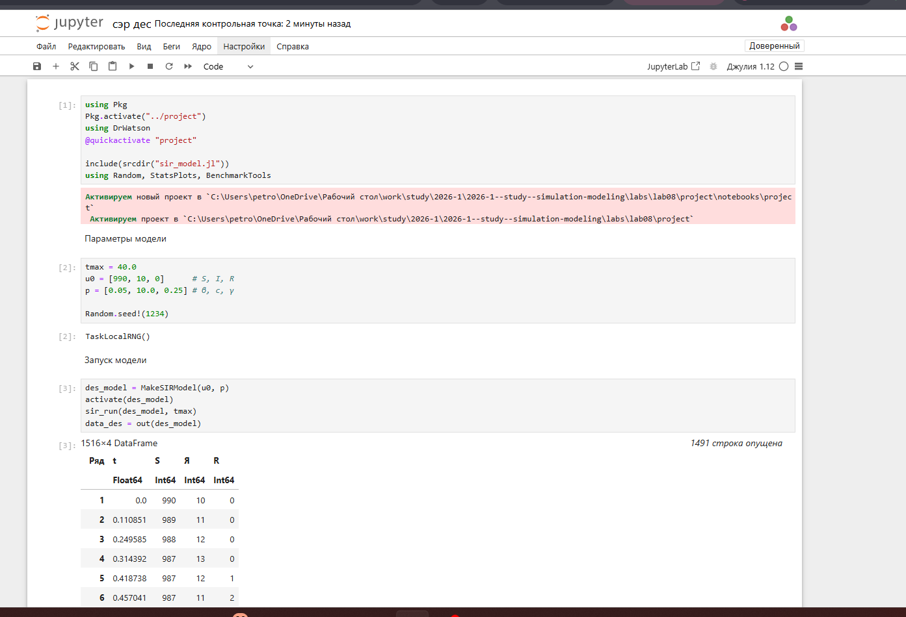
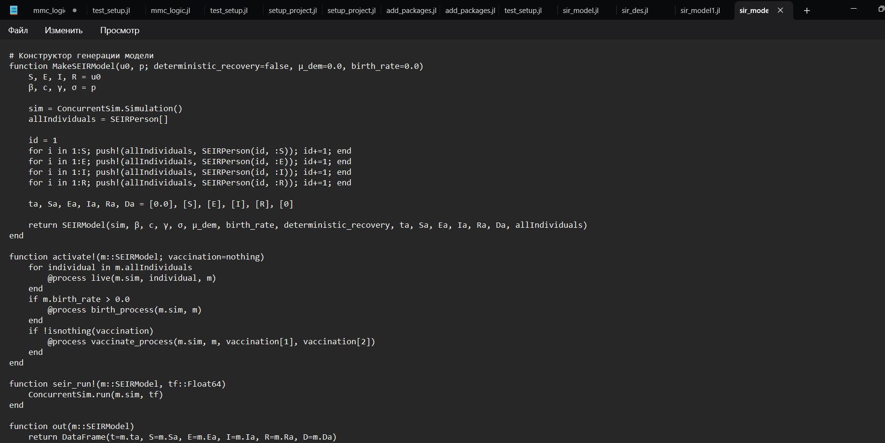
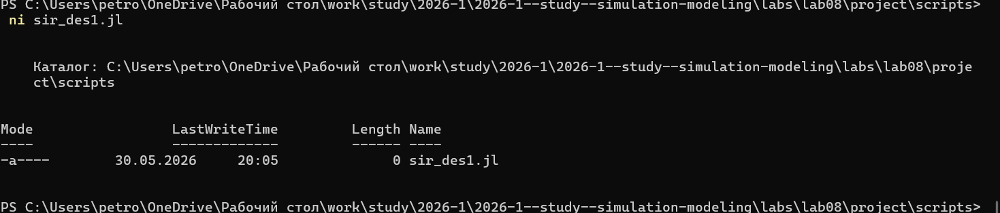
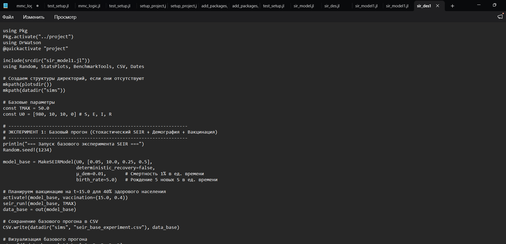
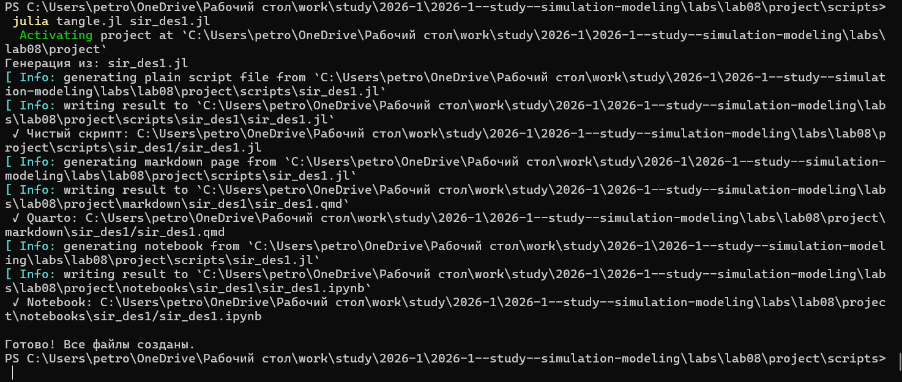
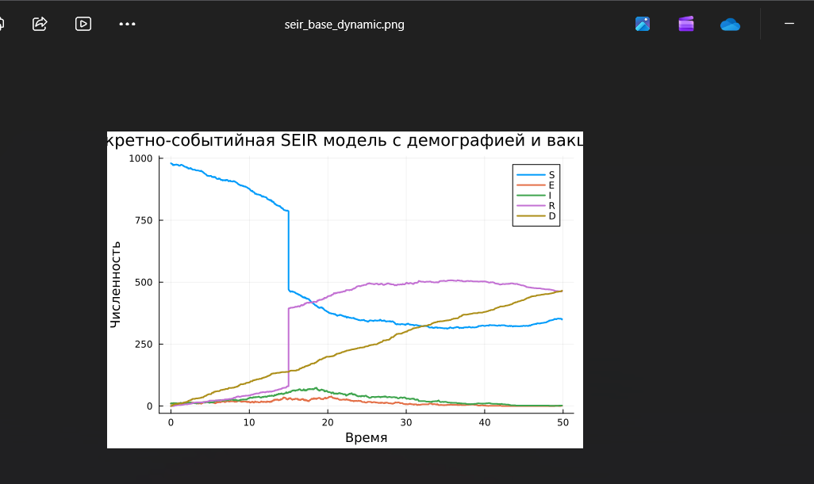
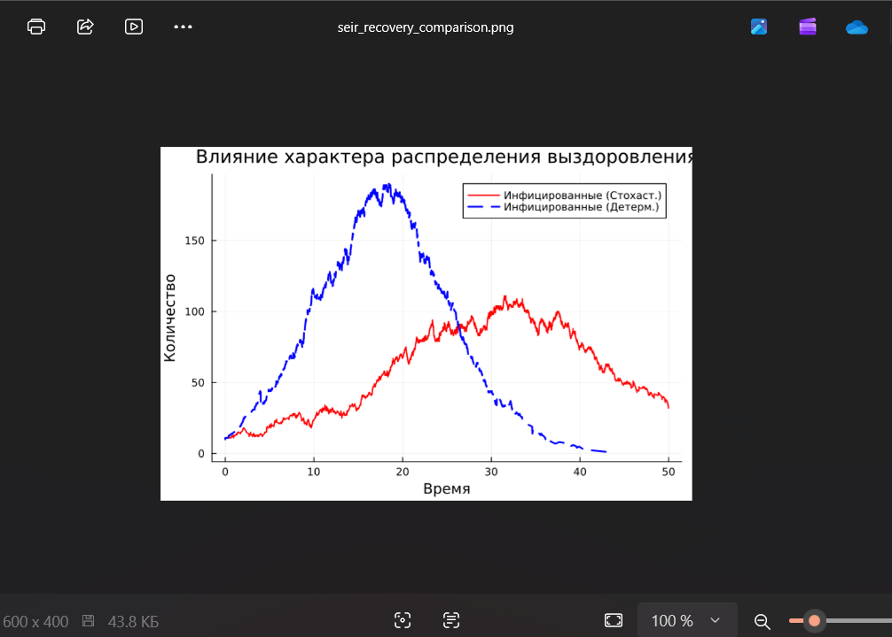
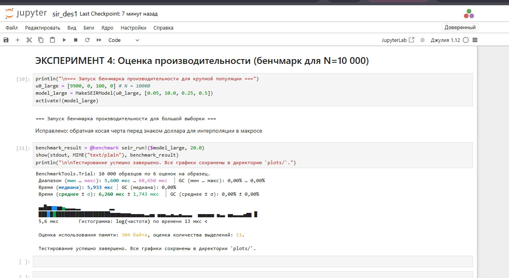

---
author:
  name: Петрова Алевтина Александровна
  email: 1132236047@rudn.ru
  affiliation:
    - name: Российский университет дружбы народов
      country: Российская Федерация
      postal-code: 117198
      city: Москва
      address: ул. Миклухо-Маклая, д. 6
title: "Отчёт по лабораторной работе №8"
subtitle: "Имитационное моделирование"
license: "CC BY"
format:
  pdf:
    lof: true
    lot: true
    toc: true
    number-sections: true
  docx:
    toc: true
    number-sections: true
engine: julia
julia:
  exeflags: ["--project=../project"]
execute:
  echo: true
  cache: false
  daemon: false
---

# Задание

- Создать рабочий каталог для всего курса.
- Установить необходимые пакеты.
- Выполнить предложенный код.
- Преобразовать код в литературный стиль.
- Сгенерировать из литературного кода:
  - чистый код;
  - jupyter notebook;
  - документацию в формате Quarto.
- Выполнить код из jupyter notebook.
- Интегрировать документацию в формате Quarto в отчёт.
- Добавить в код в литературном стиле вычисление для набора параметров.
- Сгенерировать из литературного кода с параметрами:
  - чистый код;
  - jupyter notebook;
  - документацию в формате Quarto.
- Выполнить код из jupyter notebook с параметрами.
- Интегрировать документацию с параметрами в формате Quarto в отчёт.

# Цель работы

Целью данной лабораторной работы является изучить дискретно-событийный подход к имитационному моделированию на примере классической модели распространения инфекции SIR. Реализовать стохастическую дискретно-событийную модель в виде программного комплекса на языке Julia. Провести анализ влияния параметров, сравнить со стохастической и детерминированной версиями, оценить производительность и модифицировать модель.

# Теоретическое введение

В данной работе исследуется распространение инфекционных заболеваний в изолированной популяции с использованием дискретно-событийного подхода (Discrete Event Simulation). В отличие от детерминированных систем дифференциальных уравнений, оперирующих средними величинами, стохастическое агентное моделирование позволяет учесть случайный характер контактов, индивидуальные траектории агентов и флуктуации численности классов.

## Математическая постановка и структура модели

Классическая модель расширяется до структуры **SEIR**, где каждый индивид в процессе своего жизненного цикла последовательно проходит через специфические эпидемиологические состояния, конкурирующие со случайными демографическими событиями:

1. **Susceptible ($S$)** — восприимчивые к инфекции индивиды. Пополняются за счет процесса рождаемости с интенсивностью $\text{birth\_rate}$. При контакте с инфицированным с вероятностью $\beta$ переходят в латентную фазу.
2. **Exposed ($E$)** — латентный (инкубационный) период. Индивиды уже заражены, но еще не способны передавать вирус. Время нахождения в классе распределено стохастически по экспоненциальному закону с параметром скорости перехода $\sigma$.
3. **Infectious ($I$)** — инфицированные (заразные) индивиды, являющиеся источником распространения болезни при контактах, происходящих с частотой $c$.
4. **Recovered ($R$)** — переболевшие индивиды с устойчивым иммунитетом. В этот же класс мгновенно переводится часть пула $S$ при активации механизма вакцинации.
5. **Deceased ($D$)** — умершие индивиды. Переход в это состояние возможен из любого эпидемиологического класса в результате действия фоновой естественной смертности с интенсивностью $\mu_{dem}$.

## Цели и методы исследования

Имитационное моделирование на языке Julia с использованием специализированных библиотек (`ConcurrentSim.jl`, `ResumableFunctions.jl`) позволяет решить следующие задачи:

* **Анализ характера распределений:** исследование влияния природы случайных величин путем сопоставления стохастического времени течения болезни (экспоненциальный закон) и детерминированного фиксированного периода ($1/\gamma$).
* **Анализ чувствительности параметров:** оценка динамики смещения и высоты пика заболеваемости ($\max I(t)$) при вариациях коэффициента трансмиссии $\beta$.
* **Оценка эффективности интервенций:** математическое обоснование стратегий управления эпидемией через симуляцию фазовых сдвигов и изменения объема пула $S$ в моменты проведения вакцинации.

# Выполнение лабораторной работы

Для начала проверим правильность структуры нашего проекта ([рис. @fig-001]).

{#fig-001 width=70%}

## Работа с изначальным кодом

Создадим файл src/sir_model.jl с реализацией вычислительной логики модели ([рис. @fig-002]).

{#fig-002 width=70%}

Вставляем код модели ([рис. @fig-003]).

{#fig-003 width=70%}

Создадим файл scripts/sir_des.jl. Скрипт запуска - он задаёт параметры, инициализирует модель, выполненяет прогон и визуализацию ([рис. @fig-004]).

{#fig-004 width=70%}

Вставляем скрипт ([рис. @fig-005]).

{#fig-005 width=70%}

Запустим скрипт ([рис. @fig-006]).

{#fig-006 width=70%}

Создадим производные форматы с помощью скрипта tangle.jl ([рис. @fig-007]).

{#fig-007 width=70%}

Запустим файл ipynb в jupyter-notebook ([рис. @fig-008]).

{#fig-008 width=70%}

Просмотрим результирующий график ([рис. @fig-009]).

{#fig-009 width=70%}

## Внесение изменений

Вносим необходимые изменения: исходная дискретно-событийная модель SIR была переработана и расширена до архитектуры SEIR путем добавления латентного состояния инкубационного периода (`:E`) с экспоненциальной задержкой перехода, а также интеграции эндогенных факторов демографии — непрерывного процесса рождаемости новых восприимчивых агентов и параллельного мониторинга естественной смертности на основе распределения $Exponential(1/\mu_{dem})$. Дополнительно в систему был внедрен дискретный временной триггер вакцинации для таргетированного перевода заданной доли здорового населения в пул `R`, реализована возможность переключения между стохастическим и детерминированным режимами длительности болезни, а сам скрипт симуляции адаптирован под проведение многопараметрического анализа чувствительности к вариациям коэффициента $\beta$ с автоматическим выводом метрик пиковой заболеваемости, профилированием производительности на популяции $N = 10\,000$ с помощью библиотеки `BenchmarkTools` и экспортом траекторий в уникальные CSV-файлы через инструментарий `DrWatson`.

Создаём файл модели src/sir_model1.jl ([рис. @fig-010]).

{#fig-010 width=70%}

Создадим скрипт scripts/sir_des1.jl ([рис. @fig-011]).

{#fig-011 width=70%}

Вставляем скрипт ([рис. @fig-012]).

{#fig-012 width=70%}

Запустим скрипт ([рис. @fig-013]).

{#fig-013 width=70%}

Создадим производные форматы с помощью скрипта tangle.jl ([рис. @fig-014]).

{#fig-014 width=70%}

Запустим файл ipynb в jupyter-notebook ([рис. @fig-015]).

{#fig-015 width=70%}

Просмотрим результирующие графики ([рис. @fig-016], [рис. @fig-017], [рис. @fig-018]).

{#fig-016 width=70%}

{#fig-017 width=70%}

{#fig-018 width=70%}

# Выводы

В ходе выполнения данной лабораторной работы мной был изучен дискретно-событийный подход к имитационному моделированию на примере классической модели распространения инфекции SIR. Реализована стохастическую дискретно-событийную модель в виде программного комплекса на языке Julia и проведён анализ влияния параметров, сравнение со стохастической и детерминированной версиями, так же проведена оценка производительности и модифицирована модель.

# Список литературы {.unnumbered}

1. Ross S. M. Simulation. – 5th ed. – Amsterdam : Elsevier, 2012. – 336 p. – ISBN 978-0-12-415825-2.

2. Banks J., Carson J. S., Nelson B. L., Nicol D. M. Discrete-Event System Simulation. – 5th ed. – London : Pearson, 2014. – 528 p. – ISBN 978-0-13-345342-5.

3. Law A. M. Simulation Modeling and Analysis. – 5th ed. – New York : McGraw-Hill, 2015. – 800 p. – ISBN 978-0-07-340132-9.

4. Kermack W. O., McKendrick A. G. A Contribution to the Mathematical Theory of Epidemics // Proceedings of the Royal Society of London. Series A. – 1927. – Vol. 115, no. 772. – P. 700–721.

5. Hethcote H. W. The Mathematics of Infectious Diseases // SIAM Review. – 2000. – Vol. 42, no. 4. – P. 599–653.

6. Datseris G., Vahdati A. R., DuBois T. C. Agents.jl: a performant and feature‑full agent‑based modeling software of minimal code complexity // SIMULATION. – 2022. – P. 003754972110688.

7. Кельтон В., Лоу А. Имитационное моделирование. Классика CS. – 3-е изд. – СПб. : Питер, 2004. – 847 с. – ISBN 5-94723-253-2.

8. Шеннон Р. Имитационное моделирование систем: искусство и наука. – М. : Мир, 1978. – 420 с.